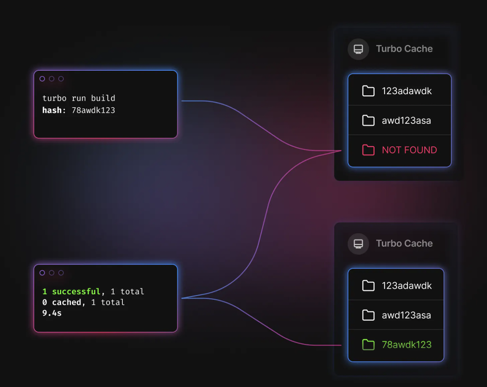
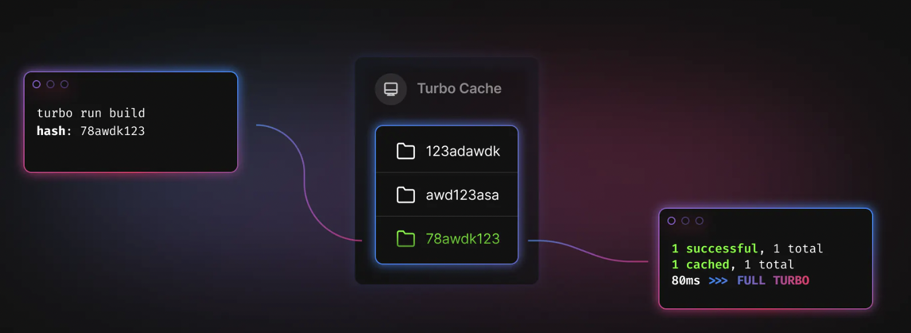

<h1> 2023-01-11 </h1>


<h2> Table Of Content </h2>   

- [✅ Docker](#-docker)
  - [linux 에서는 `host.docker.internal` 이 localhost로 자동으로 잡히지 않는다.](#linux-에서는-hostdockerinternal-이-localhost로-자동으로-잡히지-않는다)
- [✅ NginX](#-nginx)
- [✅ Turborepo](#-turborepo)
  - [Caching](#caching)
    - [프로세스](#프로세스)
    - [설정](#설정)


# ✅ Docker

## linux 에서는 `host.docker.internal` 이 localhost로 자동으로 잡히지 않는다.

- `--add-host=host.docker.internal:host-gateway` 옵션 추가하여 docker 실행

`Or`

- `host.docker.internal` ⇒  `172.17.0.1`

# ✅ NginX

1. 설정파일 경로

`/etc/nginx/nginx.conf`

+ `/etc/nginx/conf.d/default.conf`

# ✅ Turborepo

JS/TS 기반 프로젝트의 `build system` 

`caching`을 통해 태스크`(package.json.scripts)`의 속도를 올리는 것이 핵심       

## Caching

대부분의 태스크는 input(source file) 과 output(file, log(stdout, stderr))로 이루어짐

### 프로세스



- input의 hash값을 계산(e.g. `78awdk123`)
    - 기본적으로 `workspace`의 `.gitignore` 가 아닌 모든 파일을 대상으로 함.
- 해당 hash 값에 해당하는 캐싱 정보 확인
    - `./node_modules/.cache/turbo/78awdk123`
- 캐싱 정보가 없으면 실제 태스크 (`build`) 수행
- 태스크 수행 후 모든 output을 저장
    - `./node_modules/.cache/turbo/78awdk123`
    



- 캐싱 정보가 있으면, `output`을 `replay`

### 설정

- `input source`를 제약하여 캐싱 기준 정의

```json
{
  "$schema": "https://turbo.build/schema.json",
  "pipeline": {
    // ... omitted for brevity
 
    "test": {
      // A workspace's `test` task depends on that workspace's
      // own `build` task being completed first.
      "dependsOn": ["build"],
      // A workspace's `test` task should only be rerun when
      // either a `.tsx` or `.ts` file has changed.
      "inputs": ["src/**/*.tsx", "src/**/*.ts", "test/**/*.ts"]
    }
  }
}
```

- `--no-cache` : cache write ❌  cache read ⭕️
- `--force`: cache write ⭕️  cache read ❌
- 무조건 `input source`에 포함되는 파일 (바뀌면 무조건 `stale` 처리)
    - `package.json`
    - `turbo.json`
    - 추가하고 싶으면 `globalDependencies` 추가
        
        ```diff
        {
          "$schema": "https://turbo.build/schema.json",
        +  "globalDependencies": [".env"],
          "pipeline": {
            // ...other tasks
            "test": {
              "dependsOn": ["build"],
              "inputs": ["src/**/*.tsx", "src/**/*.ts", "test/**/*.ts"]
            }
          }
        }
        ```